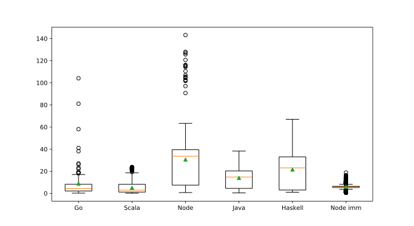
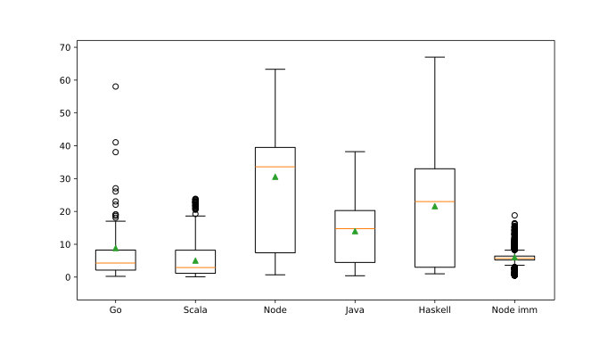

# GC latency experiment

[My blog post](https://blog.hilzu.moe/2016/06/26/studying-gc-latencies/) about the results.
[Original blog post](http://prl.ccs.neu.edu/blog/2016/05/24/measuring-gc-latencies-in-haskell-ocaml-racket/)
that has the original experiment and code.

Since writing the blog post I've run the benchmark with newer versions of languages
and added a Go benchmark.

## Run benchmarks

```
./build-all.sh
pip install -r requirements.txt
python benchmark.py
```

## Results (milliseconds)

All tests run with MacBook Pro (Retina, 15-inch, Late 2013) and macOS 10.12.6.

|                             |  Java |  Scala |  Node | Node Imm | Haskell |    Go | Python | Swift |
| --------------------------- | ----: | -----: | ----: | -------: | ------: | ----: | -----: | ----: |
| **Version**                 | 9.0.1 | 2.12.4 | 9.4.0 |    9.4.0 |   8.0.2 | 1.9.2 |  3.6.4 | 4.0.3 |
| **Min**                     |   0.4 |    0.1 |   0.7 |      0.5 |     1.0 |   0.2 |        |       |
| **Median**                  |  14.8 |    2.9 |  33.6 |      5.7 |    23.0 |   4.3 |        |       |
| **Average**                 |  14.0 |    5.0 |  30.6 |      6.0 |    21.6 |   8.8 |        |       |
| **Max**                     |  38.2 |   23.8 | 143.2 |     18.8 |    67.0 | 104.1 |        |       |
| **Avg total pause per run** | 335.7 |  371.3 | 977.9 |   1252.2 |   239.7 |  88.4 |        |       |
| **Avg pauses per run**      |    24 |   73.8 |    32 |      207 |    11.1 |    10 |        |       |
| **Avg run time (s)**        |  0.96 |   7.02 |  2.73 |     5.26 |    1.31 |  1.33 |  15.02 |  6.29 |

### Box plot of results



### Box plot zoomed in without extreme outliers


